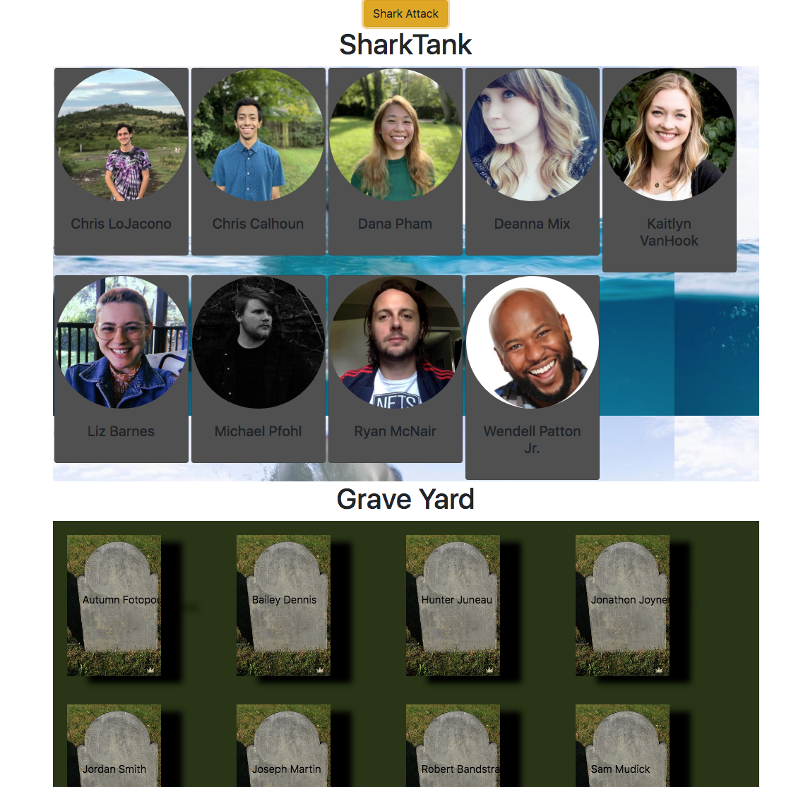

# Shark Tank

## Motivation

The motivation behind this app is to demonstrate a simple application using React

## Build status

MVP

## Code Style

Javascript ES6, Jquery, HTML5, CSS3
Bootstrap, React

## URL

[https://objective-montalcini-00b52b.netlify.app/](https://objective-montalcini-00b52b.netlify.app/)

## Screenshots:



## Features

2 sections: Sharktank with students, and graveyard with headstones
1 button: When pressed, a random student dies and goes to the graveyard

## Code Example

```
import React, { Component } from 'react';
import './App.scss';
import Graveyard from './components/graveYard';
import SharkTank from './components/sharkTank';
import students from './helpers/data/studentData';

export default class App extends React.Component {
  state = {
    liveStudents: [],
    deadStudents: []
  };

  componentDidMount() {
    this.setState({
      liveStudents: students.livingStudents(),
      deadStudents: students.dearlyBeloved()
    });
  }

  sharkAttack = () => {
    students.followTheLight();
    this.setState({
      liveStudents: students.livingStudents(),
      deadStudents: students.dearlyBeloved()
    });
  };

  render() {
    return (
      <div className="App">
        <button className="btn btn-warning" onClick={this.sharkAttack}>
          Shark Attack
        </button>
        <SharkTank liveStudents={this.state.liveStudents} />
        <Graveyard deadStudents={this.state.deadStudents} />
      </div>
    );
  }
}

```

## Creator

Will Kotheimer

### How to run it: `npminstall` `npm start`

Runs the app in the development mode.\
Open [http://localhost:3000](http://localhost:3000) to view it in the browser.

The page will reload if you make edits.\
You will also see any lint errors in the console.
